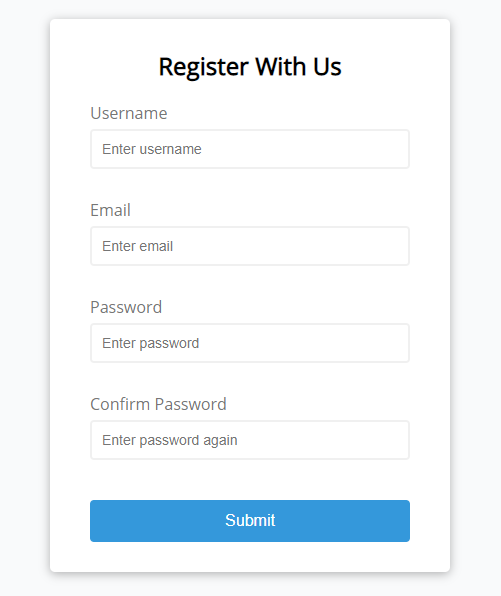

# Form Validator Project

This is a simple form validator built with the help of a tutorial video by Brad Traversy from his awesome Udemy Course `Web Projects with Vanilla Javascript`.

 

 

With basic Functionalities like;

- Validate email
- Check the length of password
- Match password with the field in confirm password
- Check for missing field and give error message
